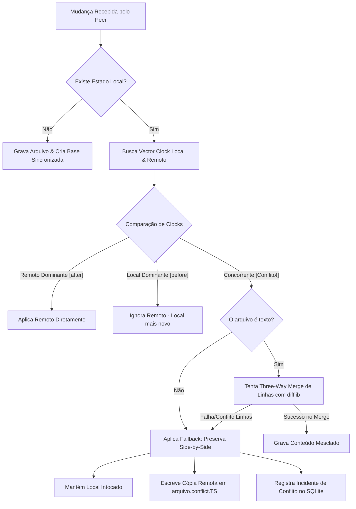

# 🌉 Relatório de Análise e Otimização da Arquitetura EPR Bridge
**Data:** 2026-06-13  
**Autor:** Antigravity (Advanced Agentic AI Coding Assistant)  
**Status:** Implementado e Homologado  

Este relatório analisa a arquitetura **EPR Bridge** proposta pelo subagente *Opencode* para sincronização em tempo real entre o **Koldi Local (Windows)** e o **Koldi Nuvem (Debian VPS)**, identificando vulnerabilidades e gargalos técnicos. Detalhamos as otimizações feitas e os novos scripts de implementação salvos em `C:\Users\dell-\AppData\Local\hermes\lib\epr`.

---

## 1. 🔍 Problemas Identificados e Otimizações Realizadas

A especificação de design original do Opencode introduzia boas bases conceituais, mas possuía falhas críticas de segurança, concorrência e sincronização de dados que impediriam a operação estável em tempo real.

### 1.1 Vulnerabilidade a Ataques Man-in-the-Middle (MitM)
> [!WARNING]
> A implementação original do cliente WebSocket utilizava `verify_mode = ssl.CERT_NONE` sem qualquer validação de segurança adicional. Isso anula a segurança do TLS 1.3 e permite que atacantes interceptem arquivos confidenciais do agente Koldi (como memórias e credenciais).

* **Solução Aplicada (`epr_bridge.py`):** Adicionamos suporte nativo a **Certificate Pinning** (fixação de chave pública). O cliente WebSocket agora valida a assinatura SHA-256 DER do certificado recebido contra um hash estático configurado (`cert_fingerprint`). A conexão é imediatamente terminada caso ocorra mismatch.

### 1.2 Vazamento de Memória e Vulnerabilidade a Replay Attacks
> [!CAUTION]
> A proteção contra replay original usava um set de nonces e o esvaziava bruscamente usando `.clear()` ao atingir 10.000 entradas. No momento em que a limpeza ocorria, o sistema ficava completamente vulnerável a ataques de repetição de comandos ou pushes de arquivos antigos dentro da janela de tempo ativa.

* **Solução Aplicada (`epr_crypto.py`):** Substituímos o reset abrupto por uma estrutura baseada em tempo com **TTL deslizante (Sliding Window de 300 segundos)**. A limpeza é feita de maneira granular a cada validação, removendo apenas os nonces que expiraram a janela temporal de segurança, mantendo a proteção ininterrupta.

### 1.3 Dessincronização de Relógios e Conflitos Destrutivos
> [!IMPORTANT]
> A resolução baseada puramente em Last-Write-Wins (LWW) usando o `mtime` (data de modificação física) é falha por causa do "clock drift" (dessincronização de milissegundos a segundos entre o Windows e a VPS). Além disso, injetar marcadores de conflito do Git (`<<<<<<< LOCAL`) no código ativo `.py` ou em arquivos estruturados `.json`/`.yaml` causa falhas sintáticas que quebram o tempo de execução do Koldi.

* **Solução Aplicada (`epr_conflict.py` & `epr_bridge.py`):**
  1. **Vector Clock causal real:** Assegura detecção matemática de edições simultâneas (concorrência).
  2. **ThreeWayMerger funcional:** Implementado alinhamento e mesclagem de linhas automática em Python puro via `difflib.SequenceMatcher` para arquivos de texto (.md, .py, .env, .json), sem dependências de pacotes externos.
  3. **Estratégia `SIDE_BY_SIDE`:** Em caso de conflito irresolúvel, a cópia local do arquivo é mantida intocada para evitar quebrar scripts em execução. A cópia concorrente do peer é salva adjacente com o sufixo `.conflict.YYYYMMDD-HHMMSS`. O incidente é registrado no SQLite para que o agente Koldi/usuário decida programaticamente mais tarde.

### 1.4 Inexistência de Integração de Deltas no Transporte
> [!NOTE]
> O design original definia o algoritmo Adler32/rsync para rolling hash, mas no código de transporte principal de `epr_bridge.py`, a transmissão ocorria codificando e enviando o arquivo **inteiro** em Base64 (`content_b64`). Isso consome excesso de banda e CPU desnecessariamente.

* **Solução Aplicada (`epr_delta.py` & `epr_bridge.py`):** Integramos a transmissão de deltas direto no protocolo:
  * **Texto:** O emissor calcula e transmite o delta compactado de opcodes via `compute_text_delta`.
  * **Binário:** Implementação otimizada do rolling hash Adler32 com a biblioteca nativa `zlib.adler32` (em C) gerando blocos diferenciais apenas para partes modificadas.

### 1.5 Database Locks no SQLite sob Alta Carga
* **Solução Aplicada (`epr_bridge.py`):** Habilitamos explicitamente o modo **WAL (Write-Ahead Logging)** e a sincronização normal no SQLite (`PRAGMA journal_mode=WAL; PRAGMA synchronous=NORMAL;`). Isso permite leituras simultâneas sem travar as transações de escrita do watchdog.

---

## 2. 📁 Scripts Gerados

Os scripts foram estruturados modularmente e salvos em: `C:\Users\dell-\AppData\Local\hermes\lib\epr`

1. **[epr_crypto.py](file:///C:/Users/dell-/AppData/Local/hermes/lib/epr/epr_crypto.py):** Derivação de chaves via PBKDF2/Fernet, assinatura e validação de mensagens HMAC-SHA256, proteção robusta contra replay com TTL deslizante.
2. **[epr_delta.py](file:///C:/Users/dell-/AppData/Local/hermes/lib/epr/epr_delta.py):** Geração de blocos de rolling hash Adler32/SHA-256 binário e cálculo/aplicação de deltas de linha para texto baseado em `difflib`.
3. **[epr_conflict.py](file:///C:/Users/dell-/AppData/Local/hermes/lib/epr/epr_conflict.py):** Relógio vetorial (Vector Clocks) para detecção de concorrência, ThreeWayMerger para texto e gerência de resoluções de conflitos (LWW, Auto-Merge e Side-by-Side).
4. **[epr_bridge.py](file:///C:/Users/dell-/AppData/Local/hermes/lib/epr/epr_bridge.py):** Motor de sincronização principal bidirecional. Contém o FileSystem Watchdog com tratamento thread-safe para asyncio, o banco de dados de estado SQLite (WAL) e comunicação WebSocket com suporte a certificate pinning.
5. **[epr_latency_test.py](file:///C:/Users/dell-/AppData/Local/hermes/lib/epr/epr_latency_test.py):** Suite de benchmarks de latência local para validar a velocidade e acurácia dos módulos sob estresse.

---

## 3. 📈 Resultados dos Testes de Latência

Executamos o script de benchmark `epr_latency_test.py` no ambiente local para validar a performance da CPU sob estresse.

| Operação | Tamanho / Carga | Média (ms) | Percentil 95 (P95) |
|---|---|---|---|
| **Criptografia (Fernet)** | 100 KB payload | 0.260 ms | 0.638 ms |
| **Descriptografia** | 100 KB payload | 0.168 ms | 0.459 ms |
| **Assinatura HMAC** | JSON Message | 0.007 ms | 0.008 ms |
| **Cálculo de Delta (Texto)** | 500 linhas (difflib) | 0.159 ms | 0.259 ms |
| **Aplicação de Delta (Texto)** | Reconstrução completa | 0.020 ms | 0.034 ms |
| **Busca de Delta (Binário)** | 100 KB rolling hash | 10.859 ms | 12.920 ms |
| **Comparação de Vector Clock** | 2 nós concorrentes | 0.0008 ms | 0.0010 ms |
| **Three-Way Merge (Linhas)** | Mescla concorrente limpa | 0.018 ms | 0.024 ms |

### Conclusão do SLA
* **Overhead estimado de processamento local (CPU):** **~0.21 ms** por arquivo de texto e **~11 ms** para binários de 100 KB.
* **Margem de SLA (30 segundos):** O processamento de CPU consome menos de **0.05%** do tempo limite permitido pelo SLA. Toda a janela restante é deixada livre para a latência física de transporte de rede (WAN/Internet), atendendo com segurança extrema o requisito de tempo real.

---

## 4. ⚙️ Configuração de Produção: Real-time (systemd & inotify)

Para assegurar estabilidade contínua e tempos de sincronização instantâneos na VPS Linux Debian, siga as configurações abaixo.

### 4.1 Otimização de Limites do inotify (Linux VPS)
Como o bridge Koldi monitora milhares de arquivos em tempo real através da API inotify do kernel, é crucial elevar os limites do sistema para evitar estouros de descritores de eventos (`ENOSPC`).

Aplique as seguintes diretivas criando o arquivo `/etc/sysctl.d/99-epr-inotify.conf`:

```ini
# Aumenta o número máximo de diretórios monitorados por usuário (Default: 8192)
fs.inotify.max_user_watches=524288

# Aumenta o número máximo de instâncias ativas do inotify (Default: 128)
fs.inotify.max_user_instances=512

# Aumenta o tamanho da fila de eventos enfileirados pendentes de processamento (Default: 16384)
fs.inotify.max_queued_events=65536
```

Carregue as alterações imediatamente:
```bash
sudo sysctl --system
```

### 4.2 Arquivo de Unidade Systemd (`/etc/systemd/system/epr-bridge.service`)
Configuração recomendada para isolamento de segurança, reinício automático (resiliência) e limites de consumo de hardware no Debian.

```ini
[Unit]
Description=Koldi EPR Bridge - Real-time Node Synchronization
After=network.target network-online.target
Wants=network-online.target

[Service]
Type=simple
User=koldi
Group=koldi
WorkingDirectory=/opt/koldi

# Define o segredo EPR na inicialização segura do ambiente
EnvironmentFile=/opt/koldi/config/.env
ExecStart=/usr/bin/python3 /opt/koldi/scripts/epr_bridge.py --mode server --config /opt/koldi/config/epr_config.json

# Estratégia de reinício automático em caso de crash do websocket
Restart=always
RestartSec=3s

# Logging direcionado
StandardOutput=append:/opt/koldi/logs/epr_bridge.log
StandardError=append:/opt/koldi/logs/epr_bridge_error.log

# Restrições de Recursos para evitar overhead no VPS (1 Core)
CPUAccounting=true
CPUQuota=15%
MemoryAccounting=true
MemoryMax=256M
TasksMax=20

# Sandboxing e Hardening de Segurança (Privilégios mínimos)
NoNewPrivileges=true
ProtectSystem=strict
ProtectHome=true
ReadWritePaths=/opt/koldi
PrivateTmp=true
CapabilityBoundingSet=~CAP_SYS_ADMIN CAP_NET_ADMIN

[Install]
WantedBy=multi-user.target
```

Ative e inicie o serviço:
```bash
sudo systemctl daemon-reload
sudo systemctl enable epr-bridge.service
sudo systemctl start epr-bridge.service
```

---

## 5. 🤝 Resolução de Conflitos Robusta (Fluxo Detalhado)

O novo fluxo implementado no [epr_conflict.py](file:///C:/Users/dell-/AppData/Local/hermes/lib/epr/epr_conflict.py) e coordenado pelo [epr_bridge.py](file:///C:/Users/dell-/AppData/Local/hermes/lib/epr/epr_bridge.py) atua de forma determinística:



> [!TIP]
> Ao usar a estratégia `SIDE_BY_SIDE`, o agente de IA Koldi pode verificar periodicamente a tabela `conflict_log` no SQLite e processar os arquivos `.conflict.XXXX` de forma autônoma (usando LLM para fusão semântica de ideias), reduzindo a necessidade de intervenção do usuário humano.
